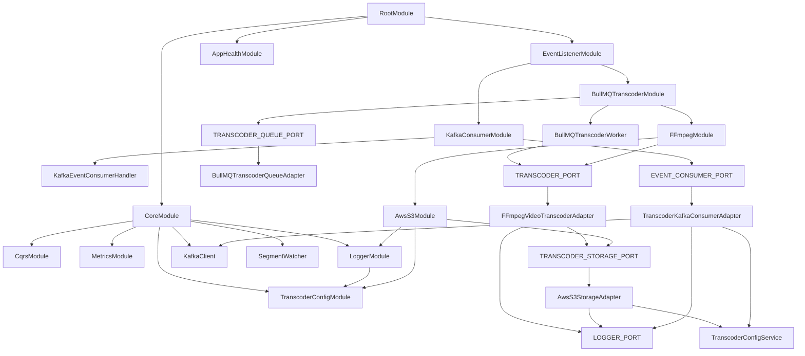

# Video Transcoder App — NestJS Module Graph

This document describes the **clean target module graph** for the `apps/video-transcoder` app.

> Naming note: your latest local version uses `CoreModule`. The GitHub `main` branch still shows the older `PlatformModule` name. The role is the same: a global foundation module imported once by `RootModule`.

---

## 1. Top-level graph

```txt
RootModule
├── CoreModule                      [global foundation]
├── EventListenerModule             [starts event → queue flow]
└── AppHealthModule                 [health/readiness checks]
```

Recommended `RootModule`:

```ts
@Module({
  imports: [CoreModule, EventListenerModule, AppHealthModule],
})
export class RootModule {}
```

`RootModule` should import only top-level composition modules. It should **not** import every small infrastructure module directly.

---

## 2. Full target graph

```txt
RootModule
├── CoreModule  [@Global]
│   ├── CqrsModule
│   ├── MetricsModule
│   ├── TranscoderConfigModule
│   │   └── exports TranscoderConfigService
│   │
│   ├── LoggerModule
│   │   ├── imports TranscoderConfigModule
│   │   ├── provides LOKI_CONFIG
│   │   ├── provides LOGGER_PORT -> LokiConsoleLogger
│   │   └── exports LOGGER_PORT
│   │
│   ├── provides KafkaClient
│   ├── provides KAFKA_CLIENT_CONFIG
│   ├── provides SegmentWatcher
│   └── exports common foundation providers/modules
│
├── EventListenerModule
│   ├── imports KafkaConsumerModule
│   ├── imports BullMQTranscoderModule
│   └── provides EventsListenerService
│
│       EventsListenerService injects:
│       ├── LOGGER_PORT                  [from CoreModule / LoggerModule]
│       ├── EVENT_CONSUMER_PORT           [from KafkaConsumerModule]
│       └── TRANSCODER_QUEUE_PORT         [from BullMQTranscoderModule]
│
├── KafkaConsumerModule
│   ├── provides KAFKA_EVENT_CONSUMER_HANDLER_CONFIG
│   ├── provides KafkaEventConsumerHandler
│   ├── provides EVENT_CONSUMER_PORT -> TranscoderKafkaConsumerAdapter
│   └── exports EVENT_CONSUMER_PORT
│
│       TranscoderKafkaConsumerAdapter injects:
│       ├── TranscoderConfigService       [from CoreModule / TranscoderConfigModule]
│       ├── KafkaEventConsumerHandler     [local provider]
│       ├── KafkaClient                   [from CoreModule]
│       └── LOGGER_PORT                   [from CoreModule / LoggerModule]
│
├── BullMQTranscoderModule
│   ├── imports BullModule.forRootAsync(...)
│   ├── imports BullModule.registerQueue(...)
│   ├── imports FFmpegModule
│   ├── provides TRANSCODER_QUEUE_PORT -> BullMQTranscoderQueueAdapter
│   ├── provides BullMQTranscoderWorker
│   └── exports TRANSCODER_QUEUE_PORT
│
│       BullMQTranscoderWorker injects:
│       └── TRANSCODER_PORT               [from FFmpegModule]
│
├── FFmpegModule
│   ├── imports AwsS3Module
│   ├── imports LoggerModule              [optional if CoreModule is global, explicit is clearer]
│   ├── provides TRANSCODER_PORT -> FFmpegVideoTranscoderAdapter
│   └── exports TRANSCODER_PORT
│
│       FFmpegVideoTranscoderAdapter injects:
│       ├── TRANSCODER_STORAGE_PORT       [from AwsS3Module]
│       └── LOGGER_PORT                   [from CoreModule / LoggerModule]
│
└── AwsS3Module
    ├── imports TranscoderConfigModule    [explicit dependency]
    ├── imports LoggerModule              [explicit dependency]
    ├── provides TRANSCODER_STORAGE_PORT -> AwsS3StorageAdapter
    └── exports TRANSCODER_STORAGE_PORT

        AwsS3StorageAdapter injects:
        ├── TranscoderConfigService
        └── LOGGER_PORT
```

---

## 3. Mermaid diagram



---

## 4. Module responsibility table

| Module                   | Responsibility                                                 | Should export                                                                                                  |
| ------------------------ | -------------------------------------------------------------- | -------------------------------------------------------------------------------------------------------------- |
| `RootModule`             | App-level composition                                          | Nothing usually                                                                                                |
| `CoreModule`             | Shared foundation: config, logger, metrics, CQRS, Kafka client | `TranscoderConfigModule`, `LoggerModule`, `MetricsModule`, `CqrsModule`, `KafkaClient`, maybe `SegmentWatcher` |
| `TranscoderConfigModule` | Env loading and validation                                     | `TranscoderConfigService`                                                                                      |
| `LoggerModule`           | Logger implementation and Loki config                          | `LOGGER_PORT`                                                                                                  |
| `MetricsModule`          | Prometheus metrics                                             | Metric providers / Prometheus module if needed                                                                 |
| `KafkaConsumerModule`    | Kafka event consumption adapter                                | `EVENT_CONSUMER_PORT`                                                                                          |
| `BullMQTranscoderModule` | Transcode job queue and worker                                 | `TRANSCODER_QUEUE_PORT`                                                                                        |
| `FFmpegModule`           | Concrete video transcoder implementation                       | `TRANSCODER_PORT`                                                                                              |
| `AwsS3Module`            | Concrete transcoder storage implementation                     | `TRANSCODER_STORAGE_PORT`                                                                                      |
| `AppHealthModule`        | Health/readiness endpoint or probes                            | Usually nothing                                                                                                |

---

## 5. Clean code shape

### `CoreModule`

```ts
@Global()
@Module({
  imports: [CqrsModule, MetricsModule, TranscoderConfigModule, LoggerModule],
  providers: [
    SegmentWatcher,
    KafkaClient,
    {
      provide: KAFKA_CLIENT_CONFIG,
      inject: [TranscoderConfigService],
      useFactory: (config: TranscoderConfigService): KafkaClientConfig => ({
        host: config.KAFKA_HOST,
        port: config.KAFKA_PORT,
        clientId: config.KAFKA_CLIENT_ID,
        accessCert: config.ACCESS_CERT,
        accessKey: config.ACCESS_KEY,
        caCert: config.KAFKA_CA_CERT,
      }),
    },
  ],
  exports: [
    CqrsModule,
    MetricsModule,
    TranscoderConfigModule,
    LoggerModule,
    KafkaClient,
    SegmentWatcher,
  ],
})
export class CoreModule {}
```

Do **not** add `TranscoderConfigService` again in `CoreModule.providers`; `TranscoderConfigModule` already owns it.

---

### `LoggerModule`

```ts
@Module({
  imports: [TranscoderConfigModule],
  providers: [
    {
      provide: LOKI_CONFIG,
      inject: [TranscoderConfigService],
      useFactory: (config: TranscoderConfigService) =>
        ({ url: config.GRAFANA_LOKI_URL }) satisfies LokiConfig,
    },
    {
      provide: LOGGER_PORT,
      useClass: LokiConsoleLogger,
    },
  ],
  exports: [LOGGER_PORT],
})
export class LoggerModule {}
```

`LoggerModule` injects `TranscoderConfigService`, so it should import `TranscoderConfigModule` directly.

---

### `EventListenerModule`

```ts
@Module({
  imports: [KafkaConsumerModule, BullMQTranscoderModule],
  providers: [EventsListenerService],
})
export class EventListenerModule {}
```

`EventListenerModule` should import only the modules that export the ports its service directly injects.

---

### `KafkaConsumerModule`

```ts
@Module({
  providers: [
    {
      provide: KAFKA_EVENT_CONSUMER_HANDLER_CONFIG,
      inject: [TranscoderConfigService],
      useFactory: (config: TranscoderConfigService) =>
        ({
          service: 'transcoder',
          logErrors: true,
          resilienceOptions: {
            circuitBreakerThreshold: 50,
            halfOpenAfterMs: 10_000,
            maxRetries: 5,
          },
          enableDlq: true,
          dlqOnApplicationException: true,
          dlqOnDomainException: false,
          sendToDlqAfterAttempts: 5,
        }) satisfies KafkaEventConsumerHandlerConfig,
    },
    KafkaEventConsumerHandler,
    {
      provide: EVENT_CONSUMER_PORT,
      useClass: TranscoderKafkaConsumerAdapter,
    },
  ],
  exports: [EVENT_CONSUMER_PORT],
})
export class KafkaConsumerModule {}
```

Because `CoreModule` is global, `KafkaClient`, `LOGGER_PORT`, and `TranscoderConfigService` are available. You may still import `TranscoderConfigModule` and `LoggerModule` explicitly if you prefer clearer dependency declarations.

---

### `BullMQTranscoderModule`

```ts
@Module({
  imports: [
    BullModule.forRootAsync({
      imports: [TranscoderConfigModule],
      inject: [TranscoderConfigService],
      useFactory: (config: TranscoderConfigService) => ({
        connection: {
          host: config.REDIS_HOST,
          port: config.REDIS_PORT,
        },
      }),
    }),
    BullModule.registerQueue({
      name: TRANSCODER_JOB_QUEUE,
    }),
    FFmpegModule,
  ],
  providers: [
    {
      provide: TRANSCODER_QUEUE_PORT,
      useClass: BullMQTranscoderQueueAdapter,
    },
    BullMQTranscoderWorker,
  ],
  exports: [TRANSCODER_QUEUE_PORT],
})
export class BullMQTranscoderModule {}
```

`BullMQTranscoderWorker` injects `TRANSCODER_PORT`, so `BullMQTranscoderModule` must import `FFmpegModule`.

---

### `FFmpegModule`

```ts
@Module({
  imports: [AwsS3Module],
  providers: [
    {
      provide: TRANSCODER_PORT,
      useClass: FFmpegVideoTranscoderAdapter,
    },
  ],
  exports: [TRANSCODER_PORT],
})
export class FFmpegModule {}
```

`FFmpegModule` exports `TRANSCODER_PORT` because `BullMQTranscoderWorker` lives outside this module and injects that token.

---

### `AwsS3Module`

```ts
@Module({
  imports: [TranscoderConfigModule, LoggerModule],
  providers: [
    {
      provide: TRANSCODER_STORAGE_PORT,
      useClass: AwsS3StorageAdapter,
    },
  ],
  exports: [TRANSCODER_STORAGE_PORT],
})
export class AwsS3Module {}
```

`AwsS3StorageAdapter` injects config and logger, so explicit imports are preferred here.

---

## 6. Important import/export rules

### Rule 1: Import only direct dependencies

A module imports another module when its own providers directly inject something exported by that module.

Example:

```txt
EventsListenerService injects EVENT_CONSUMER_PORT
→ EventListenerModule imports KafkaConsumerModule
```

```txt
BullMQTranscoderWorker injects TRANSCODER_PORT
→ BullMQTranscoderModule imports FFmpegModule
```

```txt
FFmpegVideoTranscoderAdapter injects TRANSCODER_STORAGE_PORT
→ FFmpegModule imports AwsS3Module
```

---

### Rule 2: Export only what outside modules should inject

Good exports:

```txt
KafkaConsumerModule exports EVENT_CONSUMER_PORT
BullMQTranscoderModule exports TRANSCODER_QUEUE_PORT
FFmpegModule exports TRANSCODER_PORT
AwsS3Module exports TRANSCODER_STORAGE_PORT
LoggerModule exports LOGGER_PORT
```

Avoid exporting internal implementation config unless another module truly needs it:

```txt
LOKI_CONFIG                         usually internal
KAFKA_CLIENT_CONFIG                  usually internal
KAFKA_EVENT_CONSUMER_HANDLER_CONFIG  internal to KafkaConsumerModule
```

---

### Rule 3: Global modules are for foundation only

`CoreModule` can be global because it provides foundation services:

```txt
Config
Logger
Metrics
CQRS
KafkaClient
```

Do not put feature-specific adapter bindings in `CoreModule`:

```txt
EVENT_CONSUMER_PORT        keep in KafkaConsumerModule
TRANSCODER_QUEUE_PORT      keep in BullMQTranscoderModule
TRANSCODER_PORT            keep in FFmpegModule
TRANSCODER_STORAGE_PORT    keep in AwsS3Module
```

---

## 7. Current repo cleanup checklist

Apply these if they are not already changed locally:

- [ ] If you renamed `PlatformModule` to `CoreModule`, update `RootModule` import accordingly.
- [ ] Remove duplicate `TranscoderConfigService` from `CoreModule` / `PlatformModule.providers`.
- [ ] Export `TranscoderConfigModule` from `CoreModule` / `PlatformModule`.
- [ ] Do not export `KAFKA_CLIENT_CONFIG` unless another provider outside `CoreModule` directly injects it.
- [ ] Make `LoggerModule` import `TranscoderConfigModule`.
- [ ] Make `EventListenerModule` import `KafkaConsumerModule` and `BullMQTranscoderModule`.
- [ ] Make `BullMQTranscoderModule` import `FFmpegModule`.
- [ ] Make `FFmpegModule` import `AwsS3Module` and export `TRANSCODER_PORT`.
- [ ] Make `AwsS3Module` import `TranscoderConfigModule` and `LoggerModule`.
- [ ] Add `@Injectable()` to `FFmpegVideoTranscoderAdapter` if it is missing.
- [ ] Prefer BullMQ Redis config as `{ host, port }` or a full `redis://host:port` URL, not `host:port` without protocol.
- [ ] Do not export `BullMQTranscoderWorker` unless another module explicitly injects the worker.

---

## 8. Final mental model

```txt
CoreModule
  = shared technical foundation

EventListenerModule
  = application composition for event → queue

KafkaConsumerModule
  = Kafka adapter for EVENT_CONSUMER_PORT

BullMQTranscoderModule
  = queue adapter for TRANSCODER_QUEUE_PORT and worker host

FFmpegModule
  = transcoder adapter for TRANSCODER_PORT

AwsS3Module
  = storage adapter for TRANSCODER_STORAGE_PORT
```

The clean dependency flow is:

```txt
Kafka event
  ↓
EVENT_CONSUMER_PORT
  ↓
EventsListenerService
  ↓
TRANSCODER_QUEUE_PORT
  ↓
BullMQ worker
  ↓
TRANSCODER_PORT
  ↓
FFmpeg adapter
  ↓
TRANSCODER_STORAGE_PORT
  ↓
S3 adapter
```
